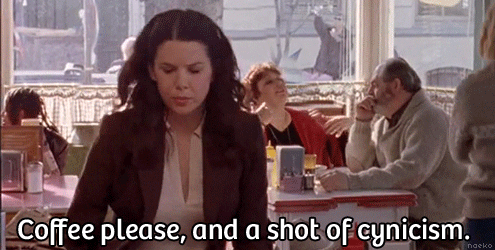
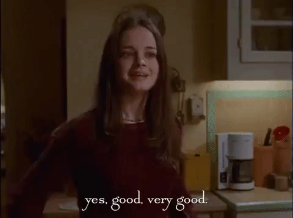
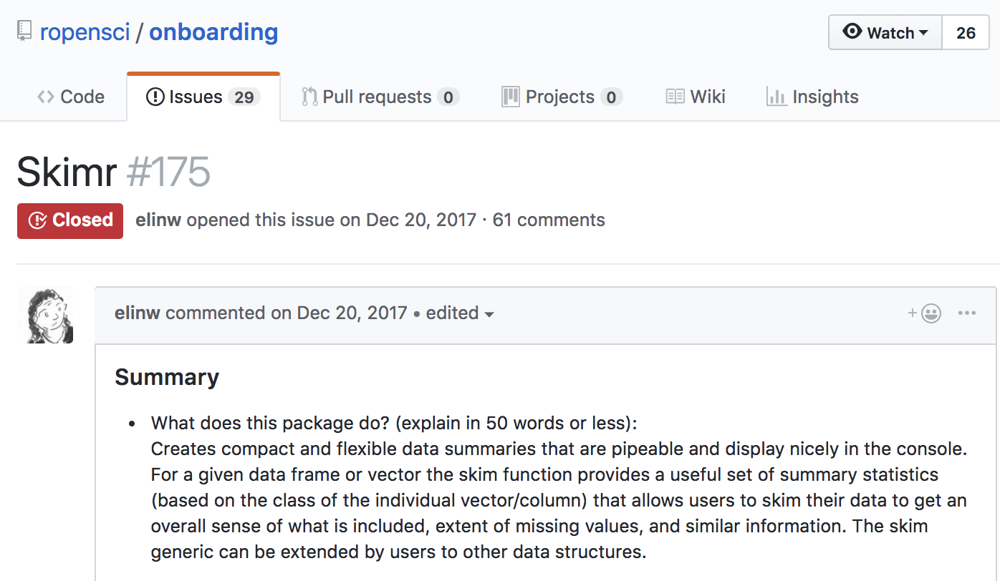
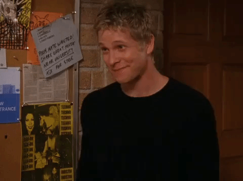

layout: true
  
<div class="my-footer"><span>bit.ly/jlt-rmed2018 • @jent103</span></div> 

---

```{r setup, echo = FALSE, message = FALSE, warning = FALSE}
knitr::opts_chunk$set(echo = FALSE, eval = FALSE, message = FALSE, dpi = 72)

library(icon)      ## for FontAwesome icons (ozunconf17 project!)
library(emo)       ## for emoji, obvs (github.com/hadley/emo)
library(tidyverse) ## for data wrangling
library(assertr)   ## for testing data

```

```{r xaringan-themer, include = FALSE}
library(xaringanthemer)
mono_light(
  base_color = "#125972", ## picked to coordinate with rOpenSci logo
  code_highlight_color = "#c0e8f5",
  link_color = "#197b9e",
  header_font_google = google_font("Josefin Sans"),
  text_font_google   = google_font("Montserrat", "300", "300i"),
  code_font_google   = google_font("Droid Mono")
)
```

# Reproducibility, for Scientific Reasons

### Given your data, someone else can reproduce your exact results

- Increased trustworthiness
- More rigorous, reliable science
- Learning more from one another's work

*"Science should be ‘show me’, not ‘trust me’; it should be ‘help me if you can’, not ‘catch me if you can’."*

-- *Philip B. Stark, [Nature 2018](https://www.nature.com/articles/d41586-018-05256-0)*

???

This is my informal definition for what we mean by computational reproducibility, which is. We all want the work we do to be both meaningful and correct, and want to be able to discern whether other research is trustworthy. Reproducible practices like sharing organized code scripts can help us with that.

---

class: center
name: personal

# Reproducibility, for Personal Reasons

"Did I mention that subjects with IDs > 100 are actually kangaroos and should be excluded?"

<hr>

I won the lottery `r emo::ji("wave")`; now my coworker is taking over

<hr>

Journal reviews back after 8 months! Time for revisions!

<hr>

"How does that patient have 15 months of treatment when we only followed people for 12 months?"

???

Our reasons for pursuing reproducibility don't have to be entirely altruistic or philosophical. The same tools that make it easier for *others* to reproduce your analyses also make it easier for you to reproduce them, and have more confidence in your own results.

True story: Someone asked me last month for a script I started writing in 2009

Even worse: This script was related to a project with five different data sources and multiple data management scripts

Past me was not living her most reproducible life :( - she had not considered this scenario nine years ago when starting this project, and it was a bit of a mess. Current me is a bit more experienced and knows to expect the unexpected.

All these tools we'll talk about today benefit from **forethought** - the more we can think ahead, the better off we'll be.

---

class: center

# Plan Ahead to Live Your Best (Research) Life

<br>
*“It’s not thinking, ‘This is easiest for myself right now.’ It’s thinking, ‘When I’m working on this next week, next month, right before I graduate — **how do I set myself up so that it’s easier later**?’*

-- *Julia Stewart Lowndes in ["A toolkit for data transparency takes shape," Nature 20 August 2018](https://www.nature.com/articles/d41586-018-05990-5)*

--

<br>

```{r, eval = TRUE}

```

???

I love this quote from Julie Lowndes - reproducibility is partially about making life easier for our future selves.

But sometimes we may feel a bit like Rory Gilmore in her first semester here at Yale, maybe that it's a little overwhelming to think years from now when you have an abstract deadline next week.

With all the tools and "best practices" that exist for reproducible research, sometimes it can be overwhelming or feel like an all-or-nothing proposition - if you haven't given someone a full Docker image and every iota of code and data, what's the point? While this is certainly the ideal, it can be intimidating depending on your starting point and the time you have available. (In the case of my hypothetical pulmonary fellow who needs a conference abstract in a week, creating a fully reproducible masterpiece is not my immediate priority.)

---

class: inverse, center, middle

## TODAY'S GOAL

Demonstrate several R tools & practices which can help us not only improve our scientific rigor, but make our lives more pleasant throughout the course of a project.

???

BUT! We can use these tools incrementally or all together - anything we do will help, and I've learned this from my own experience. My goal today: show you how these tools built for increasing the level or ease of reproducibility have been helpful in my work in clinical research. Your goal: Take what applies to and interests you and mold it to your own life (then share those ideas so we can learn from you!). Some of you may be using some or all of these tools, but hopefully we can all learn at least one new thing! I am kind of assuming that everyone is aware of and using literate programming tools like RMarkdown; if you're not, come talk to me later and I'm happy to try to convince you. :)

---

class: inverse, center, middle

# Phase I:<br>Set Yourself Up for Success

???

So the first thing I'll talk about is how to organize your project. This may feel kind of basic, but it has been really key for my sanity. And setting up our workflow well will come back to help us in a later segment, so stay tuned.

---

background-image: url(images/filestructure.png)
background-size: 32%
background-position: 15% 85%

# Organized Files, Happier Life
### One project, one directory

.pull-right[
- Keep yourself organized
- Allow someone else *(inc. your future self!)* to use your code
- Reuse/adapt components for other projects

**[RStudio Projects](https://support.rstudio.com/hc/en-us/articles/200526207-Using-Projects) + version control can help!** Projects:

- Allow >1 project open at once
- Keep you in the right place
- Encourage 1:1 philosophy
- Facilitate [`packrat`](https://cran.r-project.org/package=packrat), version control
- "Your life will be better [if you use Projects]" - *Mine Cętinkaya-Rundel, yesterday*
]

???

Here I've shown an example file structure with deidentified components for a real study that we have ongoing. This is pretty typical of what I need for my projects; you may need something different, but the point is to find an organized structure that works for you. The most important aspect is that one project equals one directory.

When things are organized well, it's not only calming, but makes things easier:

- easier to pass along to someone else, either to reproduce or take over
- easier to recognize when you can reuse components for other projects
- easier to actually reuse those components, because things are intentionally modular

If you're an RStudio user, using Projects can be helpful here, as Mine mentioned yesterday. The first reason I started using them was the ability to have more than one RStudio session open at once with no headaches, and as Mine discussed yesterday, they can help make sure we're in the correct directory. They also encourage a "one project, one directory" mindset, since each analysis gets its own directory, which gets one project file. Even more helpful is that this is also the structure that works best with version control, and Projects have several features that help facilitate getting git or other version control set up.

If you haven't yet drunk the version control Kool-Aid, I'll give you some very practical ways that it's helped me:

---

# Why You, a <span style = "font-size: 80%;">`[data person]`</span>, Should Use Version Control `r icon::fa("code-branch")`

1. Encourages modular thinking and organization
1. Easier to know when and why something changed
1. Documents/timestamps your work
1. Easier to collaborate/work on multiple machines

--
<br><br><br>
```{r, eval = TRUE, out.height = "250px", fig.align = "center"}

```

???

1. Thinking in terms of git commits has helped me make additions and changes in a more thoughtful, structured way - compare this to my former "go to a meeting, come out with a list of changes and make them all at once" approach that gets confusing and tangled.
1. When you realize something in your results has changed, it's an easier and more systematic process to figure out why. You can roll back to a previous version, see what happens, and hopefully eventually either fix the issue or explain why it was necessary.
1. Using version control gives you a bit of insurance: You can prove that you stuck to your analysis plan (which is hopefully version controlled itself!) and didn't add a bunch of post hoc analyses after you broke a treatment blind.

Basically, I use version control because I'm an optimistic cynic: One day, something will go wrong or change, or someone will question me, and this is a really helpful tool for managing those situations.

---

background-image: url(images/usethis_hex.png)
background-size: 15%
background-position: 95% 5%

# Use <span style = "font-size: 80%;">`usethis`</span> for This

[`usethis`](http://usethis.r-lib.org/) is particularly helpful for creating R packages, but has<br>
plenty of functions that will help you set up a general project:

- Projects (`create_project()`)
- Standardized file structures (`use_r()`, `use_data_raw()`)
- git and GitHub (`use_git()`, `use_github()`)
- And more!

Bonus points: Use `usethis` to turn your project into a fully transportable package!

#### **And also read these: Jenny Bryan on**

- [Project-oriented workflow](https://www.tidyverse.org/articles/2017/12/workflow-vs-script/)
- [Naming things](https://speakerdeck.com/jennybc/how-to-name-files)
- Version control:
    - ["Excuse me, do you have a moment to talk about version control?"](https://peerj.com/preprints/3159/)
    - [Happy Git with R](http://happygitwithr.com/) *with STAT545 TAs*

???

The `usethis` package is basically built to make setting up all of these details, like git repositories and file structures, a bit easier. Especially with git, getting set up can be a little tricky, for example (I know this from personal experience). And `usethis` is particularly helpful if you build R packages, as it really shines when setting up things like documentation and licensing.

And of course, read anything Jenny Bryan has written on these topics.

---

class: inverse, center, middle

# Phase II:<br>Access data programmatically

???

Now that our workflow is set up we're ready to actually work with some data. By "accessing data programmatically" I mean keeping data stored in some sort of database that is not CSV files or spreadsheets floating around, and accessing it via code of some kind rather than manually exporting or saving email attachments.

This is an ideal, of course, and depending on your situation may or may not be tenable, but I hope to inspire you to pursue it whenever possible!

---

.pull-left[
## Tired

**Many files, potentially with different versions, from disparate sources, manually created/exported**

- No one *(including future you)* knows for certain what you did
- Potential organizational nightmare
- Manually exporting from data source is a potential pain point with plenty of room for error
<br><br><br>
### `r icon::fa("file-excel", size = 3, pull = "left")` `r icon::fa("file-excel", size = 2, pull = "left")` `r icon::fa("file-excel", size = "lg", pull = "left")` `r icon::fa("file-excel", size = 1, pull = "left")`
]

.pull-right[
## Wired

**Accessing your data programmatically<br>*(REDCap API, SQL database...)***

- Track exactly what data you access + all steps taken to manipulate it
- Raw data remains in original state/location
- Rerun same script(s) throughout data collection -> use most current data to monitor, clean, explore

# `r icon::fa("database", size = 2, pull = "right")`

]

???

Our group used to use a system that involved me manually exporting about 25 forms as separate CSVs every time I went to update the data. It was, as you might imagine, not the most fun part of my day, and more importantly it was rife with opportunity for error. What if I accidentally skipped one or saved one with the wrong name?

It's hard to overcome institutional inertia if you're used to getting data in spreadsheets, and APIs might be a bit intimidating to folks who are used to receiving data in formats that they can open and see. I empathize with that, but after having Excel reformat dates and not being able to remember years later which spreadsheet contained what, I've become an API believer.

Writing code to extract data via APIs allows you to track exactly which data points you downloaded. All your original data remains untouched in a safe location, and there's a complete record of what you did to transform or summarize it. So anyone with access to that database can reproduce your work later if needed.

---

# Example: REDCap API

```{r, echo = TRUE, eval = TRUE}
library(httr)

monthly_post <- httr::POST(
  url = "https://redcap.vanderbilt.edu/api/",
  body = list(
    token = Sys.getenv("MYTOKEN"), ## API token gives you permission #<<
    content = "record",            ## export *records*
    format = "csv",                ## export as *CSV*
    forms = "monthly_data",        ## which form(s)?
    fields = c("study_id"),        ## additional fields
    events = paste(sprintf("month_%s_arm_1", 1:3), collapse = ","),
      ## all 3 monthly visit events
    rawOrLabel = "label"           ## export factor *labels* v codes
  )
)

monthly_df <- read.csv(
  text = as.character(monthly_post),
  stringsAsFactors = FALSE, na.strings = ""
)

```

???

Our group uses REDCap basically exclusively, so here I've shown an example of how I use the `httr` package to extract data via the REDCap API.

My toy example here is from a longitudinal study where we had a baseline visit; three monthly visits; and a study completion visit. I'm exporting this data in order to summarize some of the monthly values.

If you use a different data capture system your code might look a bit different. My goal is less about the specifics of the code than to demonstrate some key points:

- First, this is more secure than passing around even password-protected Excel spreadsheets, since you need an individualized API token to access the database; many of us here work with PHI, so obviously this is a concern. I usually store my token in my .Renviron file so that I can share the extraction code freely as needed without compromising security.

---

# Example: REDCap API

```{r, echo = TRUE, eval = FALSE}
library(httr)

monthly_post <- httr::POST(
  url = "https://redcap.vanderbilt.edu/api/",
  body = list(
    token = Sys.getenv("MYTOKEN"), ## API token gives you permission
    content = "record",            ## export *records*
    format = "csv",                ## export as *CSV*
    forms = "monthly_data",        ## which form(s)?                #<<
    fields = c("study_id"),        ## additional fields             #<<
    events = paste(sprintf("month_%s_arm_1", 1:3), collapse = ","), #<<
      ## all 3 monthly visit events
    rawOrLabel = "label"           ## export factor *labels* v codes
  )
)

monthly_df <- read.csv(
  text = as.character(monthly_post),
  stringsAsFactors = FALSE, na.strings = ""
)

```

???

- Next, these lines tell me exactly what data I exported - there's a **record** of exactly what we did. Here, I export the monthly data collection form, along with the patient ID that's collected on a separate form, and export only the records related to our monthly data collection. It's clear to anyone coming after me what data I used to perform my next steps.

---

# Example: REDCap API

```{r, echo = TRUE, eval = FALSE}
library(httr)

monthly_post <- httr::POST(
  url = "https://redcap.vanderbilt.edu/api/",
  body = list(
    token = Sys.getenv("MYTOKEN"), ## API token gives you permission
    content = "record",            ## export *records*
    format = "csv",                ## export as *CSV*
    forms = "monthly_data",        ## which form(s)?                
    fields = c("study_id"),        ## additional fields             
    events = paste(sprintf("month_%s_arm_1", 1:3), collapse = ","), 
      ## all 3 monthly visit events
    rawOrLabel = "label"           ## export factor *labels* v codes #<<
  )
)

monthly_df <- read.csv(
  text = as.character(monthly_post),
  stringsAsFactors = FALSE, na.strings = ""
)

```

???

- Finally, depending on your data capture system, using APIs can give you **flexibility**. This last line in the `httr` call gives an example of an option you can give REDCap using the API - here I'm telling it I want text labels for categorical variables and not the numeric codes, but there may be times when you want the opposite. You can choose based on your needs for any given export.

---

# Now We Can...

Once the initial script or report is built, we can - **with one line of code*** - do the following, always assured that we're using the most recently updated data:

1. Frequently monitor accuracy & completion during prospective data collection ([tutorial on GitHub](https://github.com/jenniferthompson/DataCleanExample))
1. Use API + RMarkdown to easily run analyses that happen repeatedly *during* prospective data collection:
    - NIH or DSMB reports
    - Study monitoring (We [use `flexdashboards`](https://jenthompson.me/2018/02/09/flexdashboards-monitoring/))
        - Are you executing the study you planned to do?
        - Enrollment targets, protocol pain points...

### API Resources

- General: [`httr`](https://cran.r-project.org/package=httr); [intro to APIs by Lucy D'Agostino McGowan](http://bit.ly/lucystats-jsm2018)
- [REDCap](https://projectredcap.org/): [`redcapAPI`](https://cran.r-project.org/package=redcapAPI) (Benjamin Nutter), [`REDCapR`](https://ouhscbbmc.github.io/REDCapR/) (Will Beasley)
- [ropensci.org/packages](https://ropensci.org/packages/) for specific web APIs

???

Once we're using the API to export data, the world is our oyster - we don't have to worry about waiting on updated spreadsheets or manually extracting data. I use this capability to do several things, including:

- Working with our research coordinators to clean our prospectively collected data every few months. There's a tutorial for our process linked from my web site if you're interested in that.
- Generate a lot of repeated analyses and reports throughout the study process - things like NIH progress reports or DSMB reports. We also use the `flexdashboard` format of RMarkdown to monitor our studies, making sure we're hitting enrollment targets and looking for potential pain points with protocol aspects like wearing devices or drawing blood. Again, I can run those reports once a week with one line of code, assured that it's current with the database.

If you're new to working with APIs, the `httr` package has some great vignettes; if you do use REDCap, there are at least two packages specifically for working with that API. If you're using other sources of web data, rOpenSci has a collection of packages for working with APIs that you should investigate.

---

class: inverse, center, middle

# Phase III:<br>Test Your (Data) Assumptions

???

Once our data is in our hands, we want to make sure it reflects our understanding of it and our needs. If you develop software, you're likely already familiar with the concept of testing; if you do any data wrangling, you've definitely done this informally - checked to see if your calculated age is negative, for example. So what I'll encourage in the next few slides is a *formal* way to incorporate those practices into data exporting and wrangling, so that we're more confident in our final data and therefore our final conclusions.

---

# Testing Data with <span style = "font-size: 80%;">`assertr`</span>

.pull-left[

### **Sinking feeling *(n)***:

Going far too long without realizing you've made a major yet sneaky error in your data wrangling.
]

.pull-right[

```{r, eval = TRUE, out.height="200px"}

```

]

--

With [`assertr`](https://github.com/ropensci/assertr) *(author: Tony Fischetti)*, we can

- Include assertions in scripts that
    - Load raw data - *is it what we expect?*
    - Create analysis datasets - *is our code doing what we expect?*
- Discover problems **early**
- Be more **confident** in your data wrangling + analysis

???

Hopefully I'm not the only one who's had this experience: You've done your data wrangling, everything looks OK, and then one day someone asks the exact right question that allows you to uncover a mistake you made.

The `assertr` package helps us avoid this by providing ways to proactively make **assertions** about our data. We can do this when reading in raw data, to make sure we understand the data we're dealing with and that the data fits the conventions we've established.

We can also do this after doing some data management, to make sure our raw data and our code are working together as well as we'd expect. Using these assertions can help us discover special cases or unmet assumptions earlier.

---

# Checking Raw Data

```{r, echo = TRUE, eval = FALSE}
library(assertr)

## Creatinine must be <=20
monthly_df %>%
  verify(creat_m <= 20)
  
```

--

.left-column[
### Result: `r emo::ji("-1")`

Pipeline stops and prints an informative message
]

.right-column[
```
verification [creat_m <= 20] failed! (1 failure)

    verb redux_fn     predicate column index value
1 verify       NA creat_m <= 20     NA     5    NA
```
```{r, echo = TRUE}
monthly_df[5, c("study_id", "redcap_event_name", "creat_m")]
```
```
  study_id redcap_event_name creat_m
5        3           Month 2      25
```
]

???

In our example study, we believe that any creatinine above 20 must be some kind of data issue. So we use `assertr`'s `verify` function at the beginning of a data management pipeline to "verify" that that assumption is true. If that condition is met, the function will return the original data.frame, and we can continue with our data management.

Of course, this being an example, the condition is *not* met. `verify` throws an error and stops our pipeline in its tracks, and prints a message showing us that the fifth row in our data.frame violates this assumption. In this case, my most likely guess is that someone forgot a decimal point. We can work with the PI or the data entry team to resolve the issue. Once it's resolved and we're using the updated data, this same pipeline will run with no issue.

One note: If you're not a pipeline user, `assertr` certainly works with base R as well! It's built to work nicely within pipelines but you can use it no matter your preference.

`verify(monthly_df, is.na(creat_m) | creat_m <= 20)`

---

# Checking Raw Data

```{r, echo = TRUE, eval = FALSE}
monthly_df %>%
  ## Visit date *must* be entered;
  ##  HDL, LDL must be within range
  assert(not_na, date_visit_m) %>%
  assert(within_bounds(25, 95), hdl_m) %>%
  assert(within_bounds(1, 200), ldl_m)
  
```

--

.pull-left[

## Result: `r emo::ji("+1")`

Returns our original data frame so we can move on down the pipeline!
]

.pull-right[
```{r, eval = TRUE}

```
]

???

It's similar to `verify`, but `assertr`'s `assert` function comes with built-in predicate functions which perform common checks; in this case, we want to make sure that every monthly visit has a recorded date, using `not_na()`, and that all our cholesterol values fall within a reasonable range using `within_bounds()`.

Here, our assertion discovers no problems, and we can continue with confidence.

---

# You Decide
## How Strict Your Assertions Are

.left-column[
#### **Q:** What if you want to test assumptions, but keep going no matter what?
#### **A:** `error_fun`
]

--

.right-column[
```{r, echo = TRUE}
## Maybe it's OK if creatinine is super high
newdf <- monthly_df %>%
  verify(creat_m <= 20, error_fun = error_append) #<<

attr(newdf, "assertr_errors")
  
```
```
[[1]]
verification [creat_m <= 20] failed! (1 failure)

    verb redux_fn     predicate column index value
1 verify       NA creat_m <= 20     NA     5    NA
```

### Result: `r emo::ji("expressionless_face")`

]

???

Sometimes you might want to know about an issue but still keep the pipeline going. The `error_fun` argument gives you control over how `assertr` behaves when the conditions are met or unmet.

You have several options; in this case, I've run our original assertion, but set this argument to `error_append`. Using this option will allow the pipeline to keep going, and will return our original data.frame as though there were no problems, but it will add an `attribute` to that data.frame which includes all our errors.

The tradeoff to this approach is that you do need to be paying attention somehow: sink those error attributes messages to a text file or take some other tactic, so you don't defeat the purpose and miss a potential problem.

---

# For More: <span style = "font-size: 80%;">`assertr`</span> [tutorial](https://ropensci.org/tutorials/assertr_tutorial/)

```{r, eval = TRUE}
knitr::include_url("https://ropensci.org/tutorials/assertr_tutorial/")
```

???

Hopefully these basic examples have intrigued you enough to investigate further. If you're interested, I'd really recommend this `assertr` tutorial that Tony has put together with some great examples.

---

class: inverse, center, middle

# Phase IV:<br>Take Advantage of That Workflow

???

Now that we've tested our data, we're finally ready to perform our analysis and report our conclusions. In my experience projects can get complex quickly, and in this case, there are some powerful tools that can help us take advantage of that structure we worked on earlier.

---

background-image: url(images/drake_hex.png)
background-size: 15%
background-position: 95% 5%

# `drake`

Built to encourage and enable efficient, reproducible workflows

.pull-left[
1. Set up a workflow made of separate components
1. Describe the `plan` that will create/update these `targets`
1. `make()` the `plan`
    - `drake` knows which components are up to date, which to update
    - Full reproducibility without unnecessary rebuilding
]

.pull-right[
Much more at:

- [ropensci.github.io/drake](https://ropensci.github.io/drake/)
- [`drake` manual](https://ropenscilabs.github.io/drake-manual/)
- Will Landau's R/Pharma talk: [wlandau.github.io/drake-talk](wlandau.github.io/drake-talk)
]

```{r, eval = TRUE, out.height = "150px", fig.align = "center"}
knitr::include_graphics("images/drake_info.svg")
```

???

I'm new to `drake` myself, and as soon as I sat down to try it out, I wished I'd had it available two years ago, when I first started work on a project that involves bootstrapping about twelve separate models.

The point of `drake` is to know when something needs to be updated and when it needs to be left in peace. You set up your workflow and define a set of components, or "targets"; describe a "plan" that will either create or update these targets as needed; and then "make" the plan. (If you're familiar with the concept of a `makefile`, that terminology will be familiar to you, but here we can do everything right within R.) `drake` knows which components need to be updated due to changes you've made since the last `make`, and which are current and can be left alone. So it takes care of any changes without wasting time or computing power on things that are already perfectly fine.

`drake` has some fantastic documentation, including a web site and a full manual. To get started, I'd recommend checking out Will Landau's recent talk at R/Pharma, which was all about `drake`. It's much more powerful than I have time to go into here.

So! You may have noticed that several times I've referenced rOpenSci, so... what exactly is rOpenSci?

---

class: center, middle

# `r knitr::include_graphics("images/ropensci_icon_lettering.png")`

#<i class="fas fa-code fa-2x"></i>&nbsp;&nbsp;&nbsp;<i class="fas fa-plus fa-sm vertical-align: 75%"></i>&nbsp;&nbsp;&nbsp;<i class="fas fa-users fa-2x"></i>

???

rOpenSci is an organization that creates the **technical** and **social** infrastructure to empower a community of people, of which I'm a part, who are interested in improving scientific research via increased reproducibility and transparency.

So, how exactly do we create that infrastructure?

---

# <i class="fas fa-code fa-lg"></i> Software

.pull-left[
### Guidelines & resources for developers
[`ropensci.github.io/dev_guide`](https://ropensci.github.io/dev_guide/)

```{r, eval = TRUE, echo = FALSE}
knitr::include_graphics("images/ropensci_devguide.png", dpi = 72)
```
]

.pull-right[
### Discoverability

- Blog posts, social media
- Searchable database

```{r, eval = TRUE, echo = FALSE}
knitr::include_graphics("images/ropensci_search.png", dpi = 72)
```
]

???

The first piece is through **software**. If you're a package developer, rOpenSci has an excellent manual to guide you through best practices in development and maintenance. This is really useful whether or not you submit your package for review with rOpenSci.

If you do successfully submit your package for review, you'll get the benefits of more discoverability: for example, rOpenSci's web site has a searchable list of all its packages, and houses material like the `assertr` tutorial I linked to earlier.

---

# <i class="fas fa-check-square fa-lg"></i> Peer Review

#### **Goal:** Bring the best facets of academic peer review to software, in a transparent, non-adversarial process

.left-column[
- **Developers:**<br>Feedback on design; visibility
- **Reviewers:**<br>Improve a package; learn about design & development
]

.right-column[
```{r, eval = TRUE}

```

```{r, eval = TRUE, fig.align = "right", out.height = "50px"}
knitr::include_graphics("https://badges.ropensci.org/87_status.svg")
```
]

???

That peer review process is the second piece of the rOpenSci puzzle. We review packages that fall within the scope of enabling and encouraging reproducible research and managing the data life cycle.

*Developers* get the benefit of feedback on design and usability, as well as additional visibility from rOpenSci blog posts. *Reviewers* get to contribute to the community, help improve a package, and almost certainly learn a lot as they do so. I was one of the reviewers for the `skimr` package, which is really fantastic, by the way, and learned a lot during the process by thinking about things like package API design.

---

# <i class="fas fa-users fa-lg"></i> Community

Welcoming, diverse community that

- Builds capacity of users & developers
- Fosters pride in members' work
- Advocates for data sharing, reusable software
- My experience: This culture and expectation leads to
    - More & better collaboration
    - Better products
    - Stronger research

--

> "rOpenSci combines expertise and approachability, and its community inspires people to collaborate as the best versions of themselves."

-- *[Will Landau](https://twitter.com/wmlandau/status/1030178221717946371), rOpenSci community member & `drake` developer*

???

Finally, we create the social infrastructure by putting together this fantastic community of people with really diverse social and professional backgrounds, all interested in making their work more reproducible and more open. By facilitating these relationships and creating a welcoming, friendly, approachable culture, we increase what we're able to produce and create more and stronger collaboration.

This quote from Will Landau sums up my feelings so well that I asked if I could just quote him: "rOpenSci combines expertise and approachability, and its community inspires people to collaborate as the best versions of themselves."

---

# Info/Get Involved

.left-column[
```{r, eval = TRUE}
knitr::include_graphics("images/ropensci_icon_short.png")

```
]

.right-column[
### [ropensci.org](https://ropensci.org)

### [discuss.ropensci.org](https://discuss.ropensci.org)

### [ropensci.org/packages](https://ropensci.org/packages)

### Contribute a package via the<br>[onboarding process](http://onboarding.ropensci.org/)<br>or [sign up to review](https://ropensci.org/onboarding/)!

### `r icon::fa("twitter")` [@ropensci](https://twitter.com/ropensci)
]

---

# Thank you!

.pull-left[
### Slides/contact
#### `r icon::fa("slideshare")` [bit.ly/jlt-rmed2018](https://bit.ly/jlt-rmed2018)
#### `r icon::fa("link")` [jenthompson.me](https://jenthompson.me)

### Find rOpenSci:
#### `r icon::fa("link")` [ropensci.org](https://ropensci.org)
#### `r icon::fa("twitter")` [@ropensci](https://twitter.com/ropensci)
]

.pull-right[
<br><br>
```{r, eval = TRUE}

```

]

---

class: inverse, middle, center

BONUS SLIDES

---

background-image: url(images/leek_decisions.png)
background-size: 85%
background-position: 50% 90%

# Jeff Leek Made This <span style = "font-size: 50%;">[JSM 2018 talk](https://docs.google.com/presentation/d/1oCbf8NHpJSQAe6LoeD--wV-KbKbdGawrLHYJqwzfj_M/edit#slide=id.p)</span>

#### Or, Use RMarkdown to Record Your Decisions

???

I love this diagram from Jeff Leek so much:

Saying "we did multivariable logistic regression" only tells the reader one of many, many decisions you made in your analysis, which can be affected by all kinds of factors as Jeff points out. So I'm starting off by encouraging you to use R's literate programming tools for not only reporting, but also for things like exploratory data analysis that informs your modeling decisions, or writing simulations that get summarized in your final report.